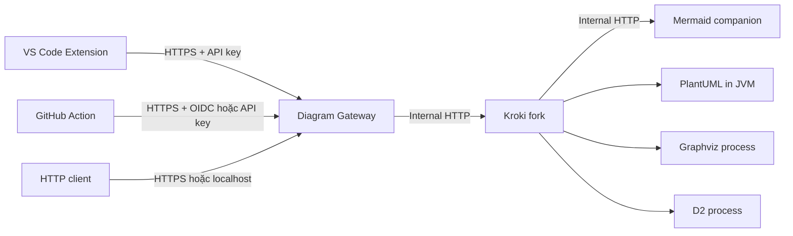

# Hướng dẫn Setup và Chạy thử E2E Diagram as Code

## 1. Mục đích

Tài liệu này là runbook từ đầu đến cuối cho MVP Diagram as Code. Một người mới có thể dùng tài liệu để:

1. Khởi động Gateway, Kroki fork và Mermaid companion.
2. Xác minh API với Mermaid, C4-PlantUML, Graphviz/DOT và D2.
3. Cài và thử VS Code Extension.
4. Tạo repository pilot với `.diagram.yml` dùng chung.
5. Cấu hình GitHub Action bằng OIDC hoặc API key.
6. Chạy các kịch bản happy path, syntax error, stale, missing, orphaned, auth, rate limit và recovery.
7. Chuẩn bị release, kiểm tra checksum/SBOM, diễn tập upgrade và rollback.

Phạm vi này kết thúc ở Phase 7. Playground, Redis/HA, auto-commit, BPMN/PDF và renderer ngoài bốn engine MVP thuộc Phase 8.

## 2. Kiến trúc được chạy thử



Chỉ Gateway được publish ra host. Kroki và Mermaid nằm trong mạng `rendering` internal của Docker Compose.

## 3. Thời gian và điều kiện hoàn thành

| Mốc | Thời gian mục tiêu |
|---|---:|
| Cài dependency và khởi động local khi đã có Docker/Node | 10-15 phút |
| API smoke và pilot bốn engine | 5 phút |
| Cài VSIX và thử preview/export | 5 phút |
| GitHub Action/OIDC | 10-20 phút, không tính thời gian cài runner |
| Full performance/soak/security gate | 5-15 phút tùy máy |

Setup local đạt yêu cầu Phase 7 khi hoàn tất trong tối đa 30 phút mà không cần đọc source code.

## 4. Yêu cầu môi trường

### 4.1 Bắt buộc

| Công cụ | Phiên bản |
|---|---|
| Git | Bản còn được hỗ trợ |
| Node.js | 24.x |
| npm | Đi cùng Node.js 24 |
| Docker Engine hoặc Docker Desktop | Có Docker Compose v2 |
| VS Code | 1.100.0 trở lên |

### 4.2 Chỉ cần khi build Kroki fork

| Công cụ | Phiên bản |
|---|---|
| Temurin JDK | 25 |
| Maven | Dùng wrapper `mvnw`/`mvnw.cmd` của repository |
| Docker Buildx | Đi cùng Docker Desktop hiện hành |

### 4.3 Kiểm tra nhanh

```powershell
git --version
node --version
npm --version
docker version
docker compose version
docker info
code --version
```

Trên Linux/macOS dùng cùng lệnh trong Bash.

## 5. Setup local từ source

### 5.1 Cài dependency

```powershell
git clone https://github.com/hnamkk/MyKroki.git
cd MyKroki
npm ci --prefix product
```

Không dùng `npm install` cho baseline/release vì có thể làm thay đổi lockfile.

### 5.2 Tạo API key

```powershell
cd product
npm run key:generate -- local-admin
```

Lệnh in hai giá trị:

- Plaintext bắt đầu bằng `dg_`: chỉ lưu ở client secret store.
- JSON verifier record: lưu trong `DIAGRAM_API_KEY_RECORDS` phía Gateway.

Không commit plaintext hoặc verifier record thật.

### 5.3 Tạo cấu hình Compose

```powershell
cd deploy
Copy-Item .env.example .env
```

Trên Bash:

```bash
cd product/deploy
cp .env.example .env
```

Mở `.env` và đặt verifier:

```dotenv
DIAGRAM_API_KEY_RECORDS=[{"id":"local-admin","verifier":"sha256:<64-hex>","scopes":["diagram:render"],"cachePartition":"local-admin","status":"active"}]
GATEWAY_PORT=9000
```

Giữ các image local/default:

```dotenv
GATEWAY_IMAGE=diagram-as-code-gateway:local
KROKI_IMAGE=yuzutech/kroki:0.31.1
MERMAID_IMAGE=yuzutech/kroki-mermaid:0.31.1
```

Để nghiệm thu đúng fork hiện tại, thay hai image renderer bằng image đã build từ checkout hoặc image `diagram-as-code-kroki`/`diagram-as-code-mermaid` của release.

### 5.4 Khởi động

```powershell
docker compose --env-file .env up -d --build
docker compose ps
```

Chờ service `gateway` healthy. Nếu máy chậm:

```powershell
docker compose logs --tail=200 gateway kroki mermaid
```

### 5.5 Khai báo credential cho terminal

PowerShell:

```powershell
$env:DIAGRAM_GATEWAY_URL = "http://localhost:9000"
$env:DIAGRAM_API_KEY = "<plaintext-dg_...>"
```

Bash:

```bash
export DIAGRAM_GATEWAY_URL=http://localhost:9000
export DIAGRAM_API_KEY='<plaintext-dg_...>'
```

## 6. Kiểm tra Gateway và API

### E2E-API-01: Liveness và readiness

```powershell
curl.exe -i http://localhost:9000/health/live
curl.exe -i http://localhost:9000/health/ready
curl.exe -s http://localhost:9000/api/v1/engines
```

Kết quả mong đợi:

- `/health/live`: HTTP 200.
- `/health/ready`: HTTP 200 và `status` là `up`.
- `/api/v1/engines`: có `mermaid`, `plantuml`, `graphviz`, `d2`; mỗi engine có version và availability.

### E2E-API-02: JSON POST

PowerShell:

```powershell
$headers = @{
  Authorization = "Bearer $env:DIAGRAM_API_KEY"
  "Content-Type" = "application/json"
}
$body = @{
  engine = "mermaid"
  format = "svg"
  source = "flowchart LR`n  Source --> Gateway --> SVG"
  options = @{}
} | ConvertTo-Json
Invoke-WebRequest `
  -Method Post `
  -Uri "$env:DIAGRAM_GATEWAY_URL/api/v1/render" `
  -Headers $headers `
  -Body $body `
  -OutFile "$env:TEMP\diagram-api.svg"
```

Kết quả mong đợi: file bắt đầu bằng `<svg`, response có `Content-Type: image/svg+xml`.

### E2E-API-03: Text POST

```powershell
$source = "@startuml`nAlice -> Bob: hello`n@enduml"
Invoke-WebRequest `
  -Method Post `
  -Uri "$env:DIAGRAM_GATEWAY_URL/api/v1/render/plantuml/svg" `
  -Headers @{ Authorization = "Bearer $env:DIAGRAM_API_KEY"; "Content-Type" = "text/plain" } `
  -Body $source `
  -OutFile "$env:TEMP\plantuml.svg"
```

### E2E-API-04: Bộ smoke chuẩn

Từ repository root:

```powershell
npm run smoke --prefix product
npm run test:renderers --prefix product
```

`test:renderers` phải pass:

- SVG: Mermaid, PlantUML/C4, Graphviz/DOT và D2.
- PNG: Mermaid, PlantUML và Graphviz.
- D2 PNG bị từ chối bằng error contract.
- Invalid source trả problem JSON an toàn.
- Remote/local include nguy hiểm bị chặn.

## 7. Pilot repository bốn engine

Fixture nằm tại `product/examples/pilot-repository`.

### 7.1 Sinh lại bốn SVG qua Gateway

```powershell
npm run build --prefix product
npm run pilot:generate --prefix product
```

Kết quả mong đợi:

```text
product/examples/pilot-repository/generated/
  deployment.svg
  rendering-topology.svg
  request-flow.svg
  system-context.svg
```

Script chờ readiness, dùng shared parser/path planner và gửi request qua public Gateway API. Có đúng bốn output hoặc lệnh fail.

### 7.2 Chạy GitHub Action ngay trong MyKroki

Workflow `.github/workflows/diagram-check.yml` dùng `.diagram-pilot.yml` ở root. Cấu hình này trỏ tới source và bốn SVG committed trong `product/examples/pilot-repository`, phù hợp với self-hosted runner đang truy cập Gateway tại `http://localhost:9000`.

1. Đặt Actions variable `DIAGRAM_GATEWAY_URL=http://localhost:9000`.
2. Đặt Actions secret `DIAGRAM_API_KEY` bằng plaintext key `dg_...`.
3. Giữ `run.cmd` và Docker Compose hoạt động.
4. Chạy workflow `Diagram check` bằng `workflow_dispatch` trên branch cần nghiệm thu.
5. Kết quả đạt khi bốn diagram được kiểm tra, `stale-count=0` và artifact preview được upload.

### 7.3 Tạo repository pilot thật

1. Tạo repository trống.
2. Copy nội dung trong `product/examples/pilot-repository/` vào root repository.
3. Commit source, `.diagram.yml`, `.diagram-renderer.lock`, workflow và bốn SVG.
4. Không copy `.env`, API key hoặc log.
5. Đặt branch mặc định là `main`.

Source trong `diagrams/` là dữ liệu gốc; output trong `generated/` là artifact tái tạo được.

## 8. VS Code Extension E2E

### 8.1 Build và cài VSIX từ source

```powershell
npm --workspace=diagram-as-code-vscode run package --prefix product
code --install-extension product/vscode-extension/dist/diagram-as-code-vscode.vsix --force
```

Hoặc cài file `diagram-as-code-vscode-<version>.vsix` từ GitHub Release.

### 8.2 Cấu hình

1. Mở thư mục pilot repository trong VS Code.
2. Đặt setting `diagramAsCode.gatewayUrl` thành `http://localhost:9000`.
3. Chạy command `Diagram: Set Gateway API Key`.
4. Nhập plaintext `dg_...`; extension lưu bằng SecretStorage.
5. Chạy `Diagram: Check Gateway Connection`.

Kết quả mong đợi: Gateway ready và bốn engine available.

### E2E-VSC-01: Live preview

1. Mở `diagrams/request-flow.mmd`.
2. Chạy `Diagram: Open Preview`.
3. Sửa source nhưng chưa save.
4. Chờ khoảng 400 ms.

Kết quả mong đợi: preview cập nhật, panel không đóng, response cũ không ghi đè source mới.

### E2E-VSC-02: Diagnostic

1. Làm Mermaid sai cú pháp, ví dụ thêm dòng `A --`.
2. Chờ preview.

Kết quả mong đợi: Problems có diagnostic tại file/dòng tương ứng; preview thành công gần nhất vẫn được giữ. Sửa source hợp lệ thì diagnostic biến mất.

### E2E-VSC-03: Export

1. Chạy `Diagram: Export...`.
2. Chọn SVG.
3. Với Mermaid/PlantUML/Graphviz có thể chọn PNG.

Kết quả mong đợi: file được ghi atomically vào output path từ `.diagram.yml`; D2 không đề xuất PNG khi engine catalog không hỗ trợ.

### E2E-VSC-04: Render on save

Đổi trong `.diagram.yml`:

```yaml
render:
  onSave: true
```

Save một source hợp lệ rồi một source lỗi. Output chỉ đổi ở lần hợp lệ; lỗi không ghi đè artifact tốt.

### E2E-VSC-05: Extension Host

```powershell
$env:VSCODE_TEST_VERSION = "1.100.0"
npm --workspace=diagram-as-code-vscode run test:e2e --prefix product
```

Chạy lại với stable:

```powershell
$env:VSCODE_TEST_VERSION = "stable"
npm --workspace=diagram-as-code-vscode run test:e2e --prefix product
```

## 9. GitHub Action với OIDC

### 9.1 Khi nào dùng runner nào

| Gateway | Runner |
|---|---|
| Chỉ truy cập trong LAN/VPN | Self-hosted runner có label `diagram-renderer` |
| Public HTTPS và firewall cho phép | GitHub-hosted `ubuntu-24.04` hoặc self-hosted |

Không dùng HTTP public. Hosted Gateway phải ở sau TLS 1.2+.

### 9.2 Lấy immutable repository ID

Với GitHub CLI:

```powershell
gh api repos/<owner>/<repository> --jq .id
```

Public và private repository dùng cùng policy theo `repositoryId`; không dựa vào tên mutable để xác định principal.

### 9.3 Cấu hình Gateway OIDC

Trong `.env` của Gateway:

```dotenv
GITHUB_OIDC_ENABLED=true
GITHUB_OIDC_AUDIENCE=diagram-gateway
GITHUB_OIDC_REPOSITORY_POLICIES=[{"repositoryId":"123456789","workflowRefs":["owner/repository/.github/workflows/diagram-check.yml@refs/*"],"events":{"pull_request":{"refs":["refs/pull/*"],"baseRefs":["main"]},"push":{"refs":["refs/heads/main"]},"workflow_dispatch":{"refs":["refs/heads/main"]}}}]
```

Áp dụng:

```powershell
docker compose --env-file .env up -d --force-recreate gateway
```

### 9.4 Cấu hình repository

1. Tạo Actions variable `DIAGRAM_GATEWAY_URL`.
2. Dùng workflow tại `.github/workflows/diagram-check.yml` của pilot fixture.
3. Giữ:

```yaml
permissions:
  contents: read
  id-token: write
```

4. Pin Action:

```yaml
- uses: hnamkk/MyKroki/product/github-action@product-v0.1.0
```

OIDC không cần PAT hoặc repository secret. `id-token: write` không trao quyền ghi repository.

### E2E-GHA-01: PR sạch

Mở pull request không làm stale output. Check `Diagram check / diagrams` phải xanh và workspace không đổi.

### E2E-GHA-02: Stale output

1. Sửa `diagrams/request-flow.mmd`.
2. Không cập nhật `generated/request-flow.svg`.
3. Push pull request.

Kết quả mong đợi: check fail, artifact `diagram-previews` có SVG đề xuất và manifest, repository không bị Action sửa.

### E2E-GHA-03: Syntax error

Commit Mermaid sai cú pháp. Kết quả mong đợi:

- Check fail.
- Annotation trỏ đến source và vị trí nếu renderer cung cấp.
- Summary có `requestId`.
- Artifact/log không chứa API key hoặc JWT.

### E2E-GHA-04: Missing và orphaned

- Xóa một SVG nhưng giữ source: trạng thái `missing`.
- Xóa source nhưng giữ SVG: trạng thái `orphaned`.

Cả hai phải fail khi `fail-on-stale: true`.

### E2E-GHA-05: Generate trên trusted event

Tạo workflow `workflow_dispatch` với `mode: generate`, `changed-only: "false"`. Action cập nhật workspace nhưng không commit. Bước sau có thể upload `generated/` làm artifact để reviewer kiểm tra.

Action phải từ chối `mode: generate` trên mọi `pull_request`, kể cả OIDC hợp lệ.

### E2E-GHA-06: Public/private/fork

| Case | Kết quả |
|---|---|
| Public repository đúng ID/workflow/event/ref | Render được |
| Private repository đúng ID/workflow/event/ref | Render được |
| Fork PR | Chỉ check read-only; không nhận repository secret |
| Sai audience/workflow/ref/repository ID | HTTP 403 hoặc auth failure rõ ràng |
| JWKS tạm lỗi nhưng key đã cache | Tiếp tục hoạt động |
| JWKS lỗi với key chưa cache | 503 và có thể retry |

## 10. GitHub Action bằng API key fallback

Chỉ dùng khi chưa bật OIDC:

1. Tạo verifier record riêng cho repository.
2. Thêm plaintext vào Actions secret `DIAGRAM_API_KEY`.
3. Đổi Action:

```yaml
with:
  gateway-url: ${{ vars.DIAGRAM_GATEWAY_URL }}
  auth-mode: api-key
  api-key: ${{ secrets.DIAGRAM_API_KEY }}
```

Không đưa key vào variable, `.diagram.yml`, workflow literal hoặc artifact.

## 11. Reliability, security và performance E2E

Các lệnh sau dùng `DIAGRAM_GATEWAY_URL` và `DIAGRAM_API_KEY` đã export.

```powershell
npm run test:security --prefix product
npm run test:performance --prefix product
npm run test:soak --prefix product
npm run test:container-policy --prefix product
```

### E2E-OPS-01: Failure isolation

```powershell
cd product/deploy
docker compose --env-file .env stop mermaid
$env:RECOVERY_EXPECT = "degraded"
npm run test:recovery --prefix ..
```

Kết quả mong đợi:

- Readiness trả 503.
- Mermaid unavailable.
- PlantUML, Graphviz và D2 vẫn render.
- Liveness vẫn 200.

### E2E-OPS-02: Automatic recovery

```powershell
docker compose --env-file .env start mermaid
$env:RECOVERY_EXPECT = "ready"
npm run test:recovery --prefix ..
```

Test chờ readiness và render Mermaid thật; 503 tạm thời trong lúc companion khởi động được retry trong deadline hữu hạn.

### E2E-OPS-03: Restart cả backend

```powershell
docker compose --env-file .env restart kroki mermaid
$env:RECOVERY_EXPECT = "ready"
npm run test:recovery --prefix ..
```

### E2E-OPS-04: Log và canary

```powershell
docker compose --env-file .env logs --no-color gateway > "$env:TEMP\gateway.log"
Select-String -Path "$env:TEMP\gateway.log" -Pattern $env:DIAGRAM_API_KEY
```

Kết quả mong đợi: không có match. Không dùng private diagram source làm canary ngoài môi trường kiểm soát.

## 12. Chuẩn bị và kiểm tra release

### 12.1 Build release bundle local

```powershell
npm run release:prepare --prefix product
```

Output:

```text
product/release/product-v0.1.0/
```

Bundle local gồm:

- VSIX.
- GitHub Action bundle.
- Release Compose và env example.
- `.diagram.yml` example và renderer lock.
- npm SPDX SBOM.
- Release notes.
- `manifest.json`.
- `SHA256SUMS`.

Tagged release workflow bổ sung SPDX SBOM cho Gateway, Kroki và Mermaid image, đồng thời ghi immutable image digest vào manifest/env.

### 12.2 Xác minh

```powershell
npm run release:verify --prefix product
```

Kiểm tra thủ công một file:

```powershell
Get-FileHash product/release/product-v0.1.0/manifest.json -Algorithm SHA256
```

Bash:

```bash
cd product/release/product-v0.1.0
sha256sum --check SHA256SUMS
```

### 12.3 Quy tắc tag

- Tag sản phẩm: `product-vX.Y.Z`.
- Không di chuyển tag đã phát hành.
- Workflow publish ba image versioned: Gateway, Kroki fork và Mermaid companion.
- Deployment dùng digest trong env release khi workflow đã tạo digest.
- Chỉ tạo tag sau khi Product CI xanh và go/no-go được duyệt.

## 13. Setup từ release artifact

1. Tải `docker-compose.yml`, `diagram-as-code.env.example`, `manifest.json`, `SHA256SUMS` và VSIX từ cùng release.
2. Xác minh checksum.
3. Copy env example thành `.env`.
4. Thay verifier placeholder.
5. Không đổi ba image reference sang `latest`.
6. Chạy:

```powershell
docker compose --env-file .env pull
docker compose --env-file .env up -d
curl.exe -f http://localhost:9000/health/ready
```

7. Chạy `smoke`, pilot generate và một VS Code preview/export.

## 14. Diễn tập upgrade và rollback

Giữ hai file:

```text
.env.product-v0.1.0
.env.product-v0.1.1
```

Mỗi file phải pin ba image cùng release, ưu tiên digest.

### Upgrade

```powershell
Copy-Item .env.product-v0.1.1 .env -Force
docker compose --env-file .env pull
docker compose --env-file .env up -d
curl.exe -f http://localhost:9000/health/ready
```

Chạy:

```powershell
npm run smoke --prefix product
npm run test:renderers --prefix product
```

### Rollback

Nếu health/smoke fail:

```powershell
Copy-Item .env.product-v0.1.0 .env -Force
docker compose --env-file .env up -d
curl.exe -f http://localhost:9000/health/ready
npm run smoke --prefix product
```

Gateway MVP không có database migration. Cache in-memory mất khi restart; source và generated artifacts vẫn nằm trong Git. Backup bắt buộc gồm `.env` đã bảo vệ, OIDC policy, API-key verifier records, reverse-proxy config và release manifest; không backup plaintext key vào repository.

## 15. Cleanup

```powershell
cd product/deploy
docker compose --env-file .env down
Remove-Item Env:DIAGRAM_API_KEY -ErrorAction SilentlyContinue
Remove-Item Env:DIAGRAM_GATEWAY_URL -ErrorAction SilentlyContinue
Remove-Item Env:RECOVERY_EXPECT -ErrorAction SilentlyContinue
```

Không xóa image/version cũ trước khi rollback rehearsal và acceptance kết thúc.

## 16. Troubleshooting

| Triệu chứng | Kiểm tra | Cách xử lý |
|---|---|---|
| Gateway không ready | `docker compose logs gateway kroki mermaid` | Chờ renderer, kiểm tra image/port và verifier JSON |
| HTTP 401 | API key sai/thiếu/revoked | Đặt lại SecretStorage/Actions secret; kiểm tra verifier |
| HTTP 403 OIDC | Repository/workflow/event/ref/audience sai | So policy với JWT claims và immutable repository ID |
| HTTP 429 | Rate hoặc bulkhead đầy | Tôn trọng `Retry-After`; giảm concurrency; không tăng limit trước benchmark |
| HTTP 503 sau restart | Companion đang khởi động | Chờ recovery test; nếu quá deadline xem log Mermaid/Kroki |
| PlantUML báo theme `default` | Client bundle cũ | Dùng Action/Extension cùng product release; shared planner mới không ép theme mặc định |
| Action không thấy base diff | Checkout shallow | Giữ `fetch-depth: 0` |
| Fork PR thiếu secret | Hành vi đúng | Dùng OIDC read-only; không chuyển sang `pull_request_target` |
| D2 PNG fail | Không hỗ trợ | Dùng SVG |
| Release verify fail | Artifact bị đổi hoặc version lệch | Không publish; build lại từ clean tag |

## 17. Ma trận acceptance

| ID | Kịch bản | Bằng chứng | Bắt buộc |
|---|---|---|---|
| ACC-01 | Health/live/ready/engines | HTTP response | Có |
| ACC-02 | Bốn engine SVG | `test:renderers`, pilot output | Có |
| ACC-03 | PNG engine hỗ trợ và D2 reject | `test:renderers` | Có |
| ACC-04 | VS Code preview/diagnostic/export/on-save | Demo + Extension Host E2E | Có |
| ACC-05 | Action check không sửa repo | PR check + `git status` | Có |
| ACC-06 | Stale/missing/orphan/syntax annotation | PR cases + artifact | Có |
| ACC-07 | OIDC public/private/fork policy | Workflow runs | Có cho hosted |
| ACC-08 | API-key fallback | Workflow run riêng | Có nếu hỗ trợ fallback |
| ACC-09 | Rate/auth/error taxonomy | Security suite | Có |
| ACC-10 | Companion isolation/recovery | Recovery report | Có |
| ACC-11 | Performance/soak | JSON reports | Có |
| ACC-12 | Release manifest/checksum/SBOM | Release bundle | Có |
| ACC-13 | Upgrade và rollback | Biên bản rehearsal | Có |
| ACC-14 | Ba full Product CI xanh liên tiếp | GitHub Actions URLs | Có trước tag |
| ACC-15 | Mentor/pilot sign-off | Issue hoặc biên bản | Có trước Go |

## 18. Known limitations của MVP

- Một Gateway replica là cấu hình khuyến nghị; cache/rate limit chưa dùng shared Redis.
- Không có playground UI.
- Không tự commit generated output.
- Không preview fenced block trong Markdown và chưa hỗ trợ VS Code Web.
- Không có admin API; key/policy thay đổi qua secret/config và restart có kiểm soát.
- PDF, BPMN và renderer ngoài Mermaid, PlantUML/C4, Graphviz/DOT, D2 chưa thuộc MVP.
- Availability 99.5% cần số liệu môi trường pilot/production, không thể kết luận chỉ từ local E2E.
